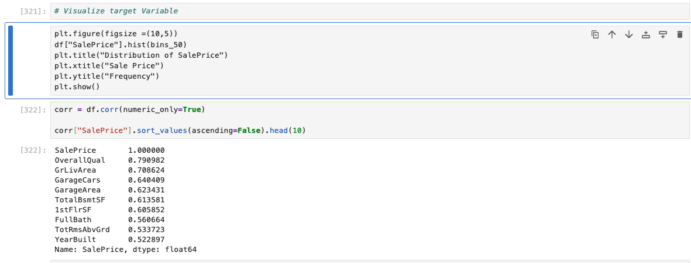
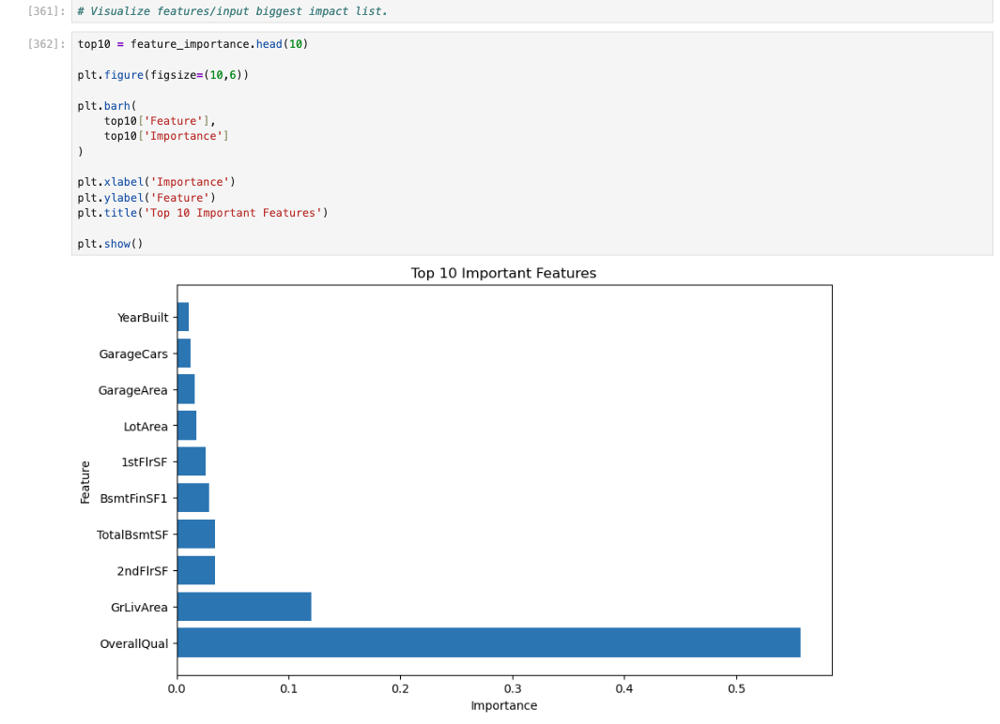

# House Price Prediction

## Overview

This project predicts house sale prices using Machine Learning techniques.

The dataset was obtained from Kaggle's House Prices competition.

---

## Dataset

House Prices - Advanced Regression Techniques

Total Records: 1460

Features: 81

---

## Data Cleaning

- Removed columns with excessive missing values
- Filled numerical missing values using median
- Filled categorical missing values using mode
- Applied One-Hot Encoding

---

## Models Used

### Linear Regression

R² Score: 0.643

### Random Forest Regressor

R² Score: 0.892

Cross Validation Score: 0.854

---

## Feature Importance

Top Features:

- OverallQual
- GrLivArea
- TotalBsmtSF
- GarageArea
- YearBuilt

---

## Technologies

- Python
- Pandas
- NumPy
- Scikit-Learn
- Matplotlib
- Jupyter Notebook

---

## Future Improvements

- Hyperparameter Tuning
- Streamlit Deployment
- XGBoost Comparison

## Sale Price Distribution

## Feature Importance

